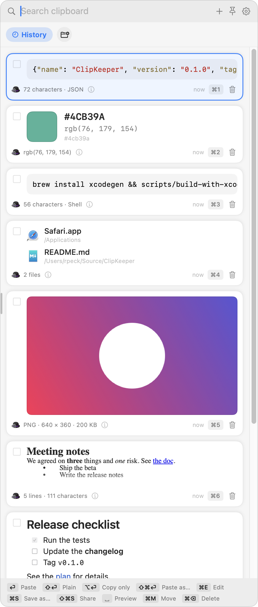

# ClipKeeper

ClipKeeper is a clipboard manager for macOS. It lets you keep your hands on
the keyboard.

ClipKeeper records everything that you copy. It shows the clips in a shelf
at the right edge of the screen. To use a clip:

1. Open the shelf. Press `⌃⌘V`, or move the mouse to the right edge of the
   screen.
   - You can change this hotkey in Settings › General, for example to
     `⌘⇧V`.
2. Select a clip with the arrow keys.
3. Press `Return`. The clip pastes into the app that you were in when you
   pressed the hotkey.

Each clip renders as what it is:

- Text
- Links
- Images
- Formatted text, also called rich text
- Files
- Colors
- Markdown
- Code, with syntax colors

To see the details of a clip, hover over the ⓘ on its card, or click it.



## Why ClipKeeper

- **Every type of clip renders correctly.**
  - Formatted text keeps its formatting.
  - Images show as thumbnails, with their format.
  - Links show the title and the icon of the page.
  - Files show their names and icons.
  - Colors show a swatch.
  - ClipKeeper renders Markdown.
  - It colors code by syntax and names the language.
- **The keyboard comes first.**
  - You move with the arrow keys, or with the cursor keys that Emacs or vim
    use.
  - `Return` pastes the clip into the active app. `Esc` closes the shelf.
  - You can change every key in Settings › Keys.
- **ClipKeeper does not lose a clip.**
  - An edit of text or a crop of an image makes a new clip. The original
    is untouched.
  - Collections hold the clips that you want to keep, such as addresses,
    replies that you use often, or code snippets. Their clips never expire.
  - Only Delete removes a clip.
- **The original formats stay.**
  - A paste includes every format that the source app supplied.
  - Paste as… and Save as… convert a clip when you ask. For example:
    - Save formatted text as Markdown.
    - Save an image in a different format.
    - Paste a link as a Markdown link.
- **Your clips stay private.**
  - Clips stay on your Mac, in files that only your user account can read.
  - ClipKeeper skips the copies that password managers make.
  - A deleted clip is gone. There is no trash.
- **Phones and Macs work without a cloud.**
  - You can securely send clips to and from Android phones, iPhones, and
    other Macs over your own local network. ClipKeeper uses the open
    LocalSend protocol, with TLS encryption.
  - Each device needs its own PIN, and you accept every transfer, for
    safety.

## Install

You need:

- macOS 15 or later.
- Xcode 26, or the Command Line Tools, to build ClipKeeper.

To install:

1. Open Terminal, and run these commands:

   ```sh
   git clone <this repository> && cd ClipKeeper
   scripts/build-with-swiftpm.sh run
   ```

2. If macOS asks whether `codesign` can use the new key, click Always
   Allow.
3. Follow the welcome window. It helps you to set:
   - The hotkey that opens the shelf.
   - The Accessibility permission, which lets ClipKeeper paste into other
     apps.
   - Launch at login.

The script does these steps:

- It checks that the tools are installed.
- On the first run, it makes a local signing identity. This identity keeps
  the Accessibility permission when you build ClipKeeper again.
- It builds `build/spm/ClipKeeper.app`.
- It starts the app.

For the Xcode method, code signing, and dependency safety, see
[docs/BUILDING.md](docs/BUILDING.md).

## Quick start

### Open and close the shelf

- Press `⌃⌘V` to open the shelf. Press `⌃⌘V` again, or `Esc`, to close it.
- You can also rest the mouse at the right edge of the screen for a moment.
  The shelf opens.
- To change the width of the shelf, drag the grip on its left edge. You can
  also set the width in Settings › General.
- Press `⌘⇧P` to pin the shelf open, for example for drag and drop. `Esc`
  still closes it.

### Find a clip

- Move the selection with one of these key pairs:
  - `↓` and `↑`.
  - `⌃N` and `⌃P`, as in Emacs.
  - `⌃J` and `⌃K`, as in vim.
- Type to search. The words can be in any order, and the start of a word is
  enough.
- The control above the list sorts the results by best match, or with the
  newest first.
- Press `Space` to see the full clip, with its details and its action
  buttons. While you type a search, `Space` types a space, so press `⌘Y`
  instead.
- Hover over the ⓘ on a card, or click it, to see:
  - The type of the clip.
  - The formats on the clipboard.
  - The size.
  - The app that the clip came from.
  - The time of the copy.

### Paste a clip

- `Return` pastes the clip into the app that you came from, and closes the
  shelf.
- `⇧Return` pastes the clip as plain text.
- `⌥Return` copies the clip to the clipboard, but does not paste it.
- `⌘⇧Return` opens Paste as…, with the formats for that clip.
- `⌘1` to `⌘9` paste the first nine clips directly.
- A double-click on a card also pastes the clip.

### Keep and organize clips

- `←` and `→`, or `⌃B` and `⌃F`, move between History and your collections.
- `⌘N` makes a new collection.
- `⌘M` moves the selected clip into a collection. To do the same with the
  mouse, drag the clip onto the tab of the collection.
- `⌘P` pins a clip to the top of its set.

### Make, change, and export clips

- `⌘+` opens an empty editor, so that you can type a clip in. On a US
  keyboard, `⌘=` does the same, without Shift.
- `⌘E` edits text, or crops an image. The result is a new clip, and the
  original is untouched.
- `⌘S` saves the clip as a file. The save panel shows the formats for that
  type of clip, with the original format first.
- `⌘O` opens a link in the browser, or shows files in Finder.
- `⌘⇧S` opens the share menu. It has these choices:
  - AirDrop.
  - Messages, Mail, Notes, and the other apps that accept shares.
  - Send to a Phone or Mac, which uses your own network.
- `⌥⌘S` sends a clip with AirDrop directly.
- `⌘⇧D` sends a clip to an Android phone, an iPhone, or another Mac on the
  same network. See [Phones and other Macs](#phones-and-other-macs).

### Bring files in

- `⌘I` imports files as separate clips. Each file becomes the type of clip
  that matches its content. For example:
  - A Markdown file becomes a Markdown clip.
  - An image file becomes an image clip.
- You can also drag files onto the shelf.
- In Finder, select files and press the shortcut of the "Add to ClipKeeper"
  service. Set the shortcut once, in System Settings › Keyboard › Keyboard
  Shortcuts › Services.
- `⌘⇧I` on a Files clip imports the contents of those files.

### Remove clips

- Press `⌘⌫`, or click the trash icon on the card. ClipKeeper asks before
  it deletes the clip.
- To work on several clips at once, check their boxes with a click or with
  `⌘⇧A`. Then move, save, or delete them together.

### Settings and the menu bar

- `⌘,` opens Settings. Settings has these tabs:
  - **General:** the hotkeys, the paste behavior, the shelf, and the mouse
    edge.
  - **Keys:** every key in the shelf. You can change each one.
  - **Privacy:** copies from password managers, link titles, and the apps
    that ClipKeeper ignores.
  - **Storage:** the limits on History, and the disk use.
  - **Devices:** phones and other Macs.
- The clipboard icon in the menu bar has these items:
  - Open Shelf.
  - Pause Capture, which stops the recording of copies until you resume.
  - Pick a Color with Eyedropper, which takes a color from the screen.
  - New Clip, which opens the empty editor.
  - Import Files as Clips.
  - Settings, and the User Guide.

The full [User Guide](docs/USER-GUIDE.md) covers every feature and every
type of clip. It also answers common problems.

## Default keys

You can change each of these keys in Settings › Keys.

| Key | Action |
|---|---|
| `⌃⌘V` | Open or close the shelf |
| `↓` `↑`, `⌃N` `⌃P`, `⌃J` `⌃K` | Move the selection |
| `←` `→`, `⌃B` `⌃F`, `⇥` `⇧⇥` | Move to the next or previous set |
| `Return` | Paste |
| `⇧Return` | Paste as plain text |
| `⌥Return` | Copy to the clipboard only |
| `⌘⇧Return` | Paste as… |
| `⌘1` – `⌘9` | Paste clip 1 to 9 |
| `Space`, `⌘Y` | Show the full clip |
| `⌘+`, `⌘=` | Type a new clip |
| `⌘E` | Edit text, or crop an image |
| `⌘S` | Save as… |
| `⌘O` | Open a link, or show files in Finder |
| `⌘⇧S` | Share… |
| `⌥⌘S` | Send with AirDrop |
| `⌘⇧D` | Send to a phone or another Mac… |
| `⌘I` | Import files as clips |
| `⌘⇧I` | Import the contents of a Files clip |
| `⌘P` | Pin or unpin |
| `⌘M` | Move to a collection… |
| `⌘D` | Duplicate |
| `⌘⌫` | Delete |
| `⌘N` | New collection |
| `⌘R` | Rename the collection |
| `⌘⇧A` | Check or uncheck the selected clip |
| `⌘A` | Check all, or uncheck all |
| `⇧↓` `⇧↑` | Check the clip and move |
| `⌘,` | Settings |
| `⌘⇧P` | Pin the shelf open |
| `Esc` | Close the shelf |

## Phones and other Macs

This section is for you if you want to move clips between a Mac and one of
these devices:

- An Android phone.
- An iPhone.
- Another Mac.

All transfers go over your own local network, with the open LocalSend
protocol and TLS encryption. There is no cloud, no account, and no server
to run. Nothing moves until you send it. Every transfer to a Mac needs the
PIN of the sender, and your OK on the Mac that receives it.

This table shows what works in this version:

| From | To | Text, links, code | Images | How |
|---|---|---|---|---|
| Phone | Mac | Yes | Not yet | The LocalSend app on the phone |
| Mac | Phone | Yes | Yes | `⌘⇧D` in the shelf |
| Mac | Mac | Yes | Not yet | `⌘⇧D` in the shelf, with ClipKeeper on both Macs |
| Mac | Mac, automatically | Not yet | Not yet | Shared collections, planned |

Files clips do not go to another device yet. AirDrop (`⌥⌘S`) still works
for any Apple device, and it sends images and files.

### Choose a path

- **An Android phone or an iPhone.**
  - Install the LocalSend app on the phone.
  - Then follow [Set up this Mac](#set-up-this-mac) and
    [Add a device](#add-a-device).
  - Then use the two send procedures.
- **Another Mac that runs ClipKeeper,** such as a home Mac and a work Mac.
  - Set up both Macs.
  - On each Mac, add the other Mac as a device.
  - Then follow [Mac to Mac](#mac-to-mac).
- **Another Mac that does not run ClipKeeper.**
  - Install the LocalSend app on that Mac.
  - ClipKeeper treats that Mac like a phone.
- **Collections that stay the same on two Macs automatically.**
  - This feature is not built yet. It is Phase C in the
    [roadmap](docs/ROADMAP.md).
  - Until then, send clips with `⌘⇧D`.

### Before you start

1. Put both devices on the same network. A guest Wi-Fi network usually
   keeps the devices apart, so use the main network.
   - Check on the Mac: hold Option and click the Wi-Fi icon in the menu
     bar. Note the IP address.
   - Check on the phone: in the Wi-Fi settings, open the details of the
     network. Its IP address must be in the same network as the Mac. For
     example, both start with `10.0.0`.
2. Some office and hotel networks keep devices apart on purpose. If the
   devices cannot find each other there, see
   [If a device does not appear](#if-a-device-does-not-appear).

You can keep the LocalSend app on the same Mac as ClipKeeper. Both use port
53317. When LocalSend has that port, ClipKeeper uses the next free port, and
Settings › Devices shows which one. Phones then show two entries for this
Mac: the LocalSend app, and ClipKeeper. To send clips, choose ClipKeeper.

### Install LocalSend on a phone

Install the official app only. Other listings and copies of the app exist,
so check the publisher.

- **Android:**
  - [LocalSend on Google Play](https://play.google.com/store/apps/details?id=org.localsend.localsend_app).
    The publisher is Tien Do Nam.
  - [LocalSend on F-Droid](https://f-droid.org/packages/org.localsend.localsend_app/).
  - The [GitHub releases page](https://github.com/localsend/localsend/releases/latest).
- **iPhone:**
  - [LocalSend on the App Store](https://apps.apple.com/us/app/localsend/id1661733229).
- **A Mac that does not run ClipKeeper:**
  - The [GitHub releases page](https://github.com/localsend/localsend/releases/latest).
  - Or run `brew install --cask localsend`.

Then set up the app:

1. Open LocalSend.
   - Check: the Receive tab shows the name of the device.
2. In the settings of LocalSend, turn Quick Save off. Then each transfer to
   the phone needs your OK on the phone, for safety.
3. Turn on the PIN for receiving, and choose a PIN. Then nothing reaches
   the phone without that PIN.

### Set up this Mac

Do these steps on every Mac that runs ClipKeeper and sends or receives
clips.

1. Open the shelf and press `⌘,`. Open the Devices tab.
2. Turn on "Send and receive clips with phones and Macs on this network".
3. Let ClipKeeper use the local network:
   1. If macOS asks to find devices on your local network, click Allow.
   2. If macOS did not ask, open System Settings › Privacy & Security ›
      Local Network. Turn on ClipKeeper.
   3. If the firewall asks about incoming connections, click Allow.
   - Check: the status line in Settings › Devices says "On", with the
     address of the Mac and the port.
4. Optional: change "Name on phones".
   - The default name, "ClipKeeper Mac", says nothing about you.
   - A name such as "Work Mac" is easier to find in a list.
5. Under Networks, leave on only the networks that you trust. ClipKeeper
   never uses VPN, virtual, or cellular connections.

### Add a device

Each device that sends to this Mac gets its own PIN.

1. In Settings › Devices, under Phones and Macs, type a name for the
   device, such as "Pixel" or "Work Mac".
2. Click Add Device.
3. Note the PIN. It has 8 characters, such as `k7mq x2ra`. To see it again
   later, click Show.
4. Give the PIN to that device only. The device asks for the PIN when it
   sends to this Mac. The space in the PIN is optional.

To stop a device, click New PIN or Remove next to it. A transfer that the
device has open stops at once.

### Send from a phone to the Mac

1. On the phone, copy the text.
2. In LocalSend, open Send, choose Text, and paste the text. You can also
   share the text to LocalSend from any app.
3. Under Nearby devices, tap the name of the Mac. If the Mac is not in the
   list, tap the refresh button next to Nearby devices.
4. Type the PIN that the Mac issued for this phone. LocalSend asks for the
   PIN every time.
5. On the Mac, the dialog "Accept from Pixel?" appears.
   - Press `Return` to accept, or `Esc` to refuse.
   - `Return` starts to work after a short moment. This stops a `Return`
     that you typed in another app from accepting the transfer.
   - Check: the text is at the top of History. An orange phone icon on the
     card shows that it came from a device.

If a dialog appears that you did not expect, refuse it. It means that
someone else has the PIN of that device. Click New PIN for that device.

### Send from the Mac to a phone

1. Open LocalSend on the phone. The app may not answer when it is in the
   background.
2. In the shelf, select a clip, or check several clips.
3. Press `⌘⇧D`. You can also press `⌘⇧S` and choose Send to a Phone or Mac.
   - When ClipKeeper knows no device yet, it looks for devices for a few
     seconds first.
4. Choose the device.
   - A shield shows a verified device.
   - A question mark shows a device that is not verified yet.
5. For the first send to a device, ClipKeeper shows 128 characters in eight
   rows. Compare them with the phone:
   1. On the phone, in LocalSend, tap this Mac, then Verify, then Text.
   2. Compare all of the characters.
   3. If they match, press `Return`.
   4. If they do not match, press `Esc`. Something on the network pretends
      to be one of the two devices.
6. Choose the device from "Which device is this?", or choose a new entry.
7. If the phone has a PIN for receiving, ClipKeeper asks for it. Type the
   PIN that you chose in LocalSend.
   - Check: the phone shows the text with a Copy button. Images go to its
     gallery or to its downloads.

The next send to that device needs no comparison. ClipKeeper checks the
certificate of the device on every send. If the certificate changes, the
send stops.

### Mac to Mac

Two Macs that both run ClipKeeper send clips to each other in the same way.
Each Mac issues a PIN to the other Mac. The Mac that receives a clip shows
the accept dialog. In these steps, the two Macs are "Home" and "Work".

1. Do [Set up this Mac](#set-up-this-mac) on both Macs.
2. On Home, add a device named "Work", and note its PIN.
3. On Work, add a device named "Home", and note its PIN.
4. To send from Home to Work: on Home, select a clip, press `⌘⇧D`, and
   choose Work.
5. For the first send, Home shows 128 characters in eight rows. Compare
   them with Work:
   1. On Work, open Settings › Devices and read its fingerprint. The
      fingerprint has four rows.
   2. The fingerprint of Work must match the top four rows or the bottom
      four rows on Home. The other four rows are the fingerprint of Home.
   3. If they match, press `Return`.
6. Choose Work from "Which device is this?".
7. Home asks for a PIN. Type the PIN that Work issued for Home in step 3.
8. On Work, the dialog "Accept from Home?" appears. Press `Return`.
   - Check: the clip is at the top of History on Work, with the orange
     icon.
9. To send from Work to Home, do steps 4 to 8 on Work.

In this version, Home asks for the PIN of Work on each send. It does not
store the PIN of another Mac.

### If a device does not appear

Do these checks in this order. Stop when the device appears.

1. Check the Local Network permission.
   - On the Mac: System Settings › Privacy & Security › Local Network. Turn
     on ClipKeeper. Then, in Settings › Devices, turn the transfer switch
     off and on again.
   - On an iPhone: Settings › Privacy & Security › Local Network. Turn on
     LocalSend.
2. Open LocalSend on the phone, and tap the refresh button next to Nearby
   devices. LocalSend looks for devices when it starts and when you
   refresh.
3. Check that the phone can reach the Mac at all:
   1. In Settings › Devices on the Mac, note the address and the port, for
      example `10.0.0.12` and `53317`.
   2. On the phone, open a browser and go to
      `https://10.0.0.12:53317/api/localsend/v2/info`, with the address
      and port of your Mac.
   3. The browser warns about the certificate, because the certificate of
      the Mac is self-signed. Continue to the page.
   4. If the page shows a line of text that starts with `{"alias"`, the
      phone can reach the Mac. The problem is in discovery: go back to
      step 1.
   5. If the page does not load, the network keeps the devices apart.
      Connect both devices to a network that you control, such as your
      home Wi-Fi or the personal hotspot of the phone.

### How the transfers are protected

- The transfer feature is off until you turn it on. It works only on the
  networks that you choose.
- All transfers use TLS encryption.
- A device must hold the certificate that you verified.
- Every transfer to a Mac needs the PIN of the sender and your OK.
- After 30 wrong PINs, the transfer feature stops until you press Restart.
- While the screen is locked, the Mac refuses transfers.
- Received clips are plain text only:
  - They never fetch a link title or an icon.
  - They never replace your own clips.
  - They have their own limit of 500 clips.
- The Mac makes its key in its Secure Enclave. The key cannot leave the
  Secure Enclave.
- Three AI models reviewed the design and the code for security, each
  model on its own. For the threat model and every finding, see
  [docs/SYNC-DESIGN.md](docs/SYNC-DESIGN.md).

The [User Guide](docs/USER-GUIDE.md#phones) has the full reference. It also
answers common problems.

## Privacy and safety

- Clips stay on your Mac, in a folder that only your user account can read.
- ClipKeeper makes one type of internet request: it fetches the title and
  the icon of a link that you copy. To stop it, turn it off in Settings ›
  Privacy.
- The transfer feature for phones and Macs is off until you turn it on. It
  uses your local network only, with these protections:
  - TLS encryption.
  - A PIN for each device.
  - Your OK on every transfer.
- ClipKeeper skips the copies that password managers make.
- You can add apps that ClipKeeper must ignore, in Settings › Privacy.
- Before you copy something that you do not want to keep, pause the
  capture from the menu bar icon.
- Delete removes the clip from the database and from the disk. There is no
  trash.

## For developers

- [docs/BUILDING.md](docs/BUILDING.md) tells how to build with SwiftPM or
  Xcode. It also covers the tests, code signing, and the debug hooks.
- [docs/ROADMAP.md](docs/ROADMAP.md) lists what comes next, in phases.
- [docs/COMPETITIVE-ANALYSIS.md](docs/COMPETITIVE-ANALYSIS.md) compares
  ClipKeeper with other clipboard managers.
- [docs/PLAN.md](docs/PLAN.md) holds the design that was agreed before the
  first code.
- [docs/SYNC-DESIGN.md](docs/SYNC-DESIGN.md) holds the design and the
  security review of the transfer feature.
- The source code has this layout:
  - `ClipKeeper/` holds the app, with one folder for each concern:
    - `App`: the start of the app and the menu bar icon.
    - `Model`: clips, collections, and clipboard snapshots.
    - `Clipboard`: capture, classification, paste, import, and export.
    - `Storage`: the database and the files on disk.
    - `Shelf`: the shelf and its views.
    - `Keys`: the key bindings.
    - `Editors`: the text editor and the crop tool.
    - `Settings`: the Settings window and the welcome window.
    - `Support`: preferences and small helpers.
    - `Transfer`: phones and other Macs.
  - `ClipKeeperTests/` holds the Swift Testing suites.
