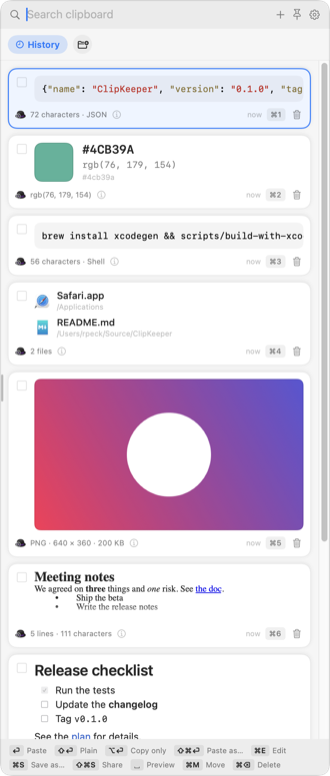
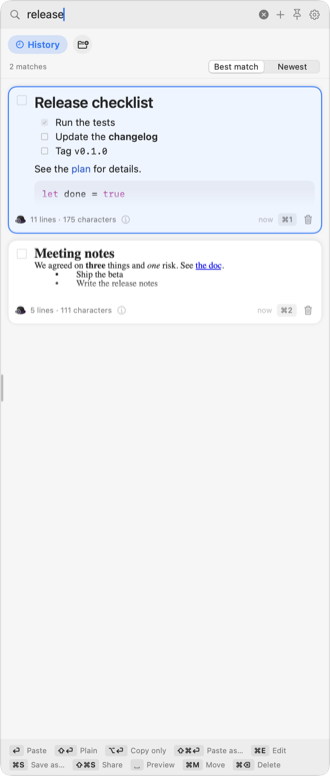
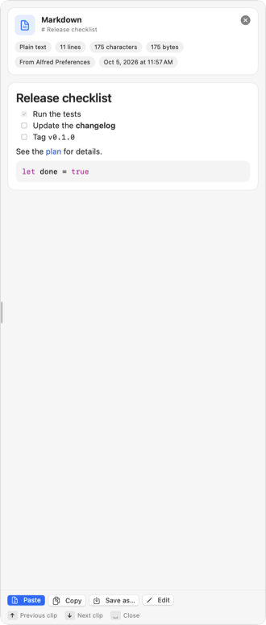
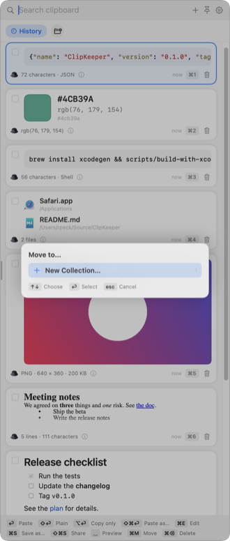
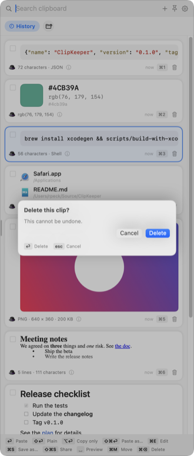
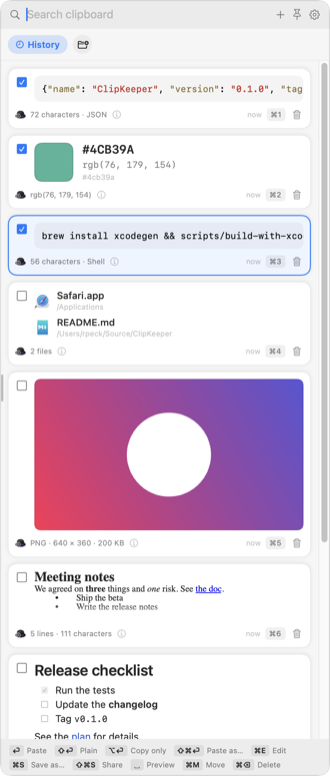
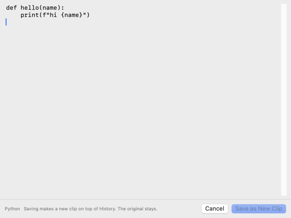
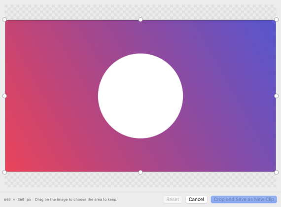
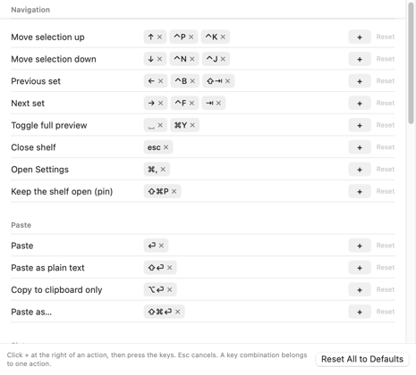
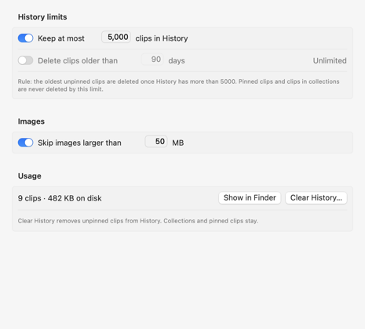

# ClipKeeper User Guide

ClipKeeper is a clipboard manager for macOS. It stores everything that you
copy and shows it in a shelf at the right edge of the screen. It keeps these
types of clips:

- Text
- Links
- Images
- Formatted text, also called rich text
- Files
- Colors
- Markdown
- Code

You choose a clip with the keyboard, or double-click it. It pastes into the
app that you were in when you opened the shelf. This guide covers every
feature. The README has the short version.

Keys are written like this: `⌃⌘V`. Safety notes are marked with 🛡.

## Contents

- [The idea in three terms](#the-idea-in-three-terms)
- [First run](#first-run)
- [The menu bar icon](#the-menu-bar-icon)
- [Open and close the shelf](#open-and-close-the-shelf)
- [The shelf](#the-shelf)
- [Move and search](#move-and-search)
- [Preview a clip](#preview-a-clip)
- [Paste](#paste)
- [Clip types](#clip-types)
- [Special cases](#special-cases)
- [Collections](#collections)
- [Pin, duplicate, delete](#pin-duplicate-delete)
- [Work with several clips at once](#work-with-several-clips-at-once)
- [Type a new clip](#type-a-new-clip)
- [Edit and crop](#edit-and-crop)
- [Save a clip as a file](#save-a-clip-as-a-file)
- [Share and AirDrop](#share-and-airdrop)
- [Phones](#phones)
- [Open links and files](#open-links-and-files)
- [Import files as clips](#import-files-as-clips)
- [The eyedropper](#the-eyedropper)
- [Pause capture](#pause-capture)
- [Settings](#settings)
- [Keyboard reference](#keyboard-reference)
- [Privacy and safety](#privacy-and-safety)
- [Where the data lives](#where-the-data-lives)
- [Problems and answers](#problems-and-answers)

## The idea in three terms

- **Clip.** One thing you copied: text, code, an image, a link, a color, or
  files. ClipKeeper keeps every format the source app provided, so a paste
  is the same as the original copy.
- **History.** Every Copy operation adds a clip to the top of History. Old
  clips leave the bottom of History when it reaches the limits you set. See
  [Settings › Storage](#settings).
- **Collection.** A named set of clips that you keep intentionally, for
  example a collection of AI prompts, or of email signatures. Clips in a
  collection never expire. You move a clip into a collection yourself. A
  copy never lands in a collection by itself.

## First run

ClipKeeper lives in the menu bar. It has no Dock icon and no main window.
On the first launch a welcome window walks you through three steps.

1. **Hotkey.** The default is `⌃⌘V` (Control-Command-V). It is free in the
   common apps; `⌘⇧V` was not, because browsers, Slack, and code editors
   use it for "Paste and Match Style". Evernote users take note: Evernote
   claims `⌃⌘V` system-wide for "Paste to Evernote", so pick another key
   there. To change the hotkey, click the field and press the keys you
   want.
2. **Accessibility.** When you tell it to paste a clip, ClipKeeper presses
   `⌘V` for you in the app you came from. macOS asks for the Accessibility
   permission for that.
   - Click Open Accessibility Settings.
   - Turn on ClipKeeper in the list.
3. **Launch at login.** Turn it on so the shelf is always ready.

Without the Accessibility permission, `Return` copies the clip to the
clipboard and closes the shelf. You then press `⌘V` yourself. The shelf
footer says "Copy" instead of "Paste" while the permission is missing.

You can change all three later in Settings › General.

## The menu bar icon

Click the clipboard icon in the menu bar for these items:

- **Open Shelf.** Same as the hotkey.
- **Pause Capture / Resume Capture.** Stops or restarts recording. See
  [Pause capture](#pause-capture).
- **Pick a Color with Eyedropper….** See [The eyedropper](#the-eyedropper).
- **New Clip….** Type a clip in. See [Type a new clip](#type-a-new-clip).
- **Settings….** Opens the Settings window.
- **User Guide.** Opens this document.
- **Quit ClipKeeper.**

The icon fills for a moment each time a copy is recorded.

## Open and close the shelf

There are three ways to open the shelf:

- **Hotkey.** Press `⌃⌘V`. Press it again, or press `Escape`, to close.
- **Mouse.** Rest the pointer at the right edge of the screen for a moment.
  The shelf slides in on that screen. Move the pointer away from the shelf
  and it slides out again.
- **Menu bar.** Click the icon and choose Open Shelf.

The shelf also closes when you click anywhere outside it, and after a
paste.

**Keep it open.** Press `⌘⇧P`, or click the pin at the top of the shelf,
and the shelf stays open: after a paste, when you click into another app,
and when the mouse leaves it. Use this to drag several clips out, or to
drop files in, without the shelf closing between each one. Press `Escape`
or the hotkey to close it. Press `⌘⇧P` again to unpin. The pin is
remembered.

The shelf opens on the screen that holds the window you are working in. The
mouse trigger opens it on the screen that holds the pointer.

## The shelf

From top to bottom the shelf has:

- **Search field.** It has the keyboard focus when the shelf opens. Type to
  filter. The buttons at its right:
  - `+` opens an empty editor, so that you can type a new clip. See
    [Type a new clip](#type-a-new-clip).
  - The pin keeps the shelf open. See [Open and close the shelf](#open-and-close-the-shelf).
  - The gear opens Settings.
- **Clip set tabs.** History is first. Each collection has a tab. The
  button with a folder icon makes a new collection.
- **Clip list.** Newest first. Pinned clips stay at the top. The selected clip
  has a blue border.
- **Key hints.** The footer shows the keys that apply to the selected clip.

Drag the left edge of the shelf to change its width, from 200 to 800
points. A small grip marks the edge. The width is remembered, and Settings ›
General has a slider for it too.

Each clip card shows:

- A checkbox at the left, for
  [working with several clips at once](#work-with-several-clips-at-once).
- The content, rendered by type.
- The icon of the app you copied from.
- A summary, such as `40 lines · 1545 characters · Python` or `PNG · 2548 × 1204 · 563 KB`.
- An ⓘ icon. Hover it, or click it, for the type, the formats on the
  clipboard (such as PNG or JPEG), the size, the source app, and the copy
  time. The [preview](#preview-a-clip) shows the same details in its header.
- The age of the clip.
- A `⌘1` to `⌘9` badge on the first nine clips.
- A trash icon that deletes the clip.
- A pin icon when the clip is pinned.

## Move and search

- `↓` `↑` move the selection. So do the cursor keys that Emacs uses,
  `⌃N` `⌃P`, and the ones that vim uses, `⌃J` `⌃K`.
- `←` `→` or `⌃B` `⌃F` switch between History and the collections.
  `⇥` and `⇧⇥` do the same.
- `Space` opens the [preview](#preview-a-clip). While the search field
  holds text, `Space` types a space, so press `⌘Y` instead.
- **Type** to search. The list filters as you type.
- When the search field holds text, `←` `→` move the caret and `⌫` deletes
  text. `⇥` `⇧⇥` still switch sets. Clear the field with the ⓧ button.

Click a clip to select it. Double-click a clip to paste it.

**How search ranks the results.** Search matches whole words and word
prefixes: `rel` finds "Release checklist". Words can be in any order and do
not have to be next to each other. A clip that contains more of your words,
or contains them more often, ranks higher. A word that is rare across your
clips counts more than a common one, and a match in the first line counts
more than a match deep in the text. Short clips rank above long clips with
the same matches. Pinned clips stay on top.

A control above the results switches the order between **Best match** and
**Newest**. The choice is remembered.

## Preview a clip

Press `Space`, or choose Full Preview from a card's right-click menu, to see
the whole clip. While you type a search, press `⌘Y` instead of `Space`. The header shows the type, the formats on the clipboard,
the size, the source app, and the copy time. The buttons at the bottom
paste, copy, save, or edit the clip.

- `Space`, `⌘Y`, or `Escape` closes the preview.
- `↓` `↑` move to the next or previous clip while the preview is open.

## Paste

- `Return` pastes the selected clip into the app you came from and closes
  the shelf. The clip goes back to the clipboard in its original form, with
  every format the source app provided:
  - Rich text pastes with its formatting.
  - Images paste as images, in their original format.
  - A link pastes as its URL.
  - A color pastes as its text, and as a color object for apps that take one.
  - Files paste as file references, so a paste in Finder copies the files.
- `⇧Return` pastes as plain text. For a link it pastes the URL. For a color
  it pastes the hex value. For files it pastes the paths.
- `⌥Return` copies the clip to the clipboard and closes the shelf, without
  a paste. Use this to paste later, or in an app that needs a special paste
  command.
- `⌘⇧Return` opens Paste as…. Pick a representation with `↓` `↑` and
  `Return`, or press its number. The choices depend on the type; see
  [Clip types](#clip-types).
- `⌘1` to `⌘9` paste the first nine clips of the current set without moving
  the selection.

**Without the Accessibility permission**, every paste action above copies
the clip to the clipboard and closes the shelf, and you press `⌘V` in the
app yourself. Settings › General shows the permission status.

By default the pasted clip stays where it is in History. Turn on
"Move a clip to the top of History after pasting it" in Settings › General
to keep History in most-recently-used order.

## Clip types

ClipKeeper looks at each copy and decides its type. The type sets the
preview, the Paste as… choices, and the Save as… formats.

**Text**
- Plain text.
- Save as .txt.

**Markdown**
- Text with headings, lists, links, emphasis, fences, or tables.
- Rendered as Markdown, with syntax colors in fenced code blocks.
- Save as .md or .txt.

**Code**
- Text that looks like source code. ClipKeeper recognizes Python, JavaScript,
  TypeScript, Swift, shell, JSON, YAML, HTML, XML, CSS, SQL, Go, Rust, C, C++,
  Objective-C, Java, Kotlin, C#, Ruby, PHP, TOML, Lisp, Dockerfile, Makefile,
  and diffs.
- Rendered with syntax colors. The language shows in the summary line.
- Save with the language's extension, as .txt, or as a Markdown code block.

**Rich text**
- Copies with fonts, bold, italic, links, or lists, from a browser, Mail,
  Pages, Word, or TextEdit.
- Rendered as formatted text.
- Paste as: original, plain text, Markdown, HTML.
- Save as: .rtf, .rtfd (with attachments), .html, .md, .txt. The original
  format is first in the list.

**Image**
- Screenshots and copied images. PNG, TIFF, JPEG, HEIC, and GIF. The
  summary line and the ⓘ details name the format.
- Rendered as a thumbnail. `Space` shows the full image.
- Paste as: original, PNG, JPEG, TIFF.
- Save as: the original format, PNG, JPEG, TIFF, or HEIC.
- `⌘E` opens the crop tool. Cropping makes a new clip; the original is
  unchanged.

**Link**
- A web address, such as `https://example.com/page`.
- Shows the page title and the site icon. ClipKeeper fetches them from the
  site once. Turn this off in Settings › Privacy.
- Paste as: original, URL, title, Markdown link `[title](url)`.
- Save as .webloc, .txt, or .md.
- `⌘O` opens the link in the browser.

**Color**
- A color from a color picker, from the eyedropper, or text such as
  `#4cb39a`, `rgb(76, 179, 154)`, or `hsl(160, 40%, 50%)`.
- Shows a swatch with the hex and rgb values.
- Paste as: original, hex, `rgb()`, CSS, SwiftUI `Color(...)`.

**Files**
- Files copied in Finder.
- Shows each file with its icon and folder.
- `Return` pastes the file references, so a paste in Finder copies the files.
- Paste as: original, or the paths as text.
- `⌘O` reveals the files in Finder.

## Special cases

- 🛡 **Passwords.** Password managers mark their copies as concealed, and
  ClipKeeper does not record those.
  - Covered: 1Password, Bitwarden, and similar apps, and the built-in
    password managers of Safari, Chrome, Edge, and the macOS Passwords app.
  - Not covered: a password you type and copy yourself from a document. That
    is ordinary text and is recorded.
  - See [Privacy and safety](#privacy-and-safety).
- **Copying the same thing twice.** The existing clip moves to the top of
  History. No duplicate is made.
- **Very large images.** Images above the size limit in Settings › Storage
  are not recorded. The default limit is 50 MB.
- **Excluded apps.** Copies made in apps on the list in Settings › Privacy
  are never recorded.

## Collections

Every Copy operation adds to History, and History follows the retention
limits. A collection is a named set of clips that you keep intentionally,
for example a collection of AI prompts. Clips in a collection never expire.

- **New collection.** Press `⌘N`, or click `+` in the tab row. Type a name and
  press `Return`.
- **Move a clip.** Select it and press `⌘M`. Pick the collection with `↓` `↑`
  and `Return`, or press its number. The last item in the picker makes a new
  collection and moves the clip there in one step.
- **Drag a clip** onto a collection tab to move it there. Drag it onto the
  History tab to move it back.
- **Rename.** Open the collection and press `⌘R`, or right-click its tab.
- **Delete.** Right-click the tab and choose Delete Collection. The clips move
  back to History. Nothing is lost.
- **Order in a collection.** Newest addition first. Pinned clips stay at the
  top.

A copy always goes to History, never straight into a collection. Move it
there intentionally.

## Pin, duplicate, delete

- `⌘P` pins or unpins the selected clip. Pinned clips stay at the top of
  their set and never expire.
- `⌘D` duplicates the selected clip.
- `⌘⌫` deletes the selected clip. The trash icon on the card does the same.
- `⌫` also deletes when the search field is empty.

🛡 **What can remove a clip.** Only two things: you delete it, or a History
limit in Settings › Storage removes an old, unpinned History clip. Editing,
cropping, and moving never change or remove a clip. Before a delete,
ClipKeeper asks: `Return` confirms, `Escape` cancels. Turn the question off
in Settings › General if you prefer.

## Work with several clips at once

Every card has a checkbox at the left. It is faint until you hover the card
or check it.

- Click a checkbox to check or uncheck that clip.
- `⌘⇧A` checks or unchecks the selected clip, so you never need the mouse.
- `⇧↓` checks the selected clip and moves down. `⇧↑` does the same going
  up. Hold `⇧` and repeat to check a run of clips.
- `⌘A` checks every clip in the list. Press it again to uncheck them all.

While any clip is checked, these actions apply to all checked clips:

- `⌘M` moves them to a collection.
- `⌘S` saves them into a folder, each in its default format.
- `⌘⌫` deletes them after one confirmation.

With nothing checked, the same actions apply to the selected clip.

## Type a new clip

Type text that you want to keep, such as an address or a reply you use
often, without copying it from somewhere first.

1. In the shelf, press `⌘+`, or click `+` at the top of the shelf. On a US
   keyboard, `⌘=` does the same, without Shift.
   - Or choose New Clip… from the menu bar icon.
2. Type the text in the window that opens.
3. Press `⌘Return`, or click Add Clip. `Escape` cancels.

The clip goes to the top of the set that was open in the shelf: History,
or a collection. ClipKeeper classifies it like a copy, so typed Markdown
becomes a Markdown clip and typed code a code clip.

The `+` at the end of the set tabs, with a folder icon, makes a new
collection instead.

## Edit and crop

🛡 Editing never changes the original. The result is a new clip at the top
of History. Delete the original yourself if you do not want it. Safety first!

**Text, Markdown, code, rich text, links, colors**
1. Select the clip and press `⌘E`.
2. An editor window opens with the text. Code uses a monospaced font.
3. Press `⌘Return`, or click Save as New Clip. `Escape` cancels.

The new clip is plain text. ClipKeeper classifies it again, so edited code
stays code and edited Markdown stays Markdown. Rich text becomes plain text,
because the editor edits the text, not the formatting.

**Images**
1. Select the clip and press `⌘E`.
2. Drag on the image to draw the area to keep.
3. Drag inside the area to move it. Drag a corner or an edge handle to
   resize it. Drag outside the area to start over.
4. The footer shows the size in pixels.
5. Press `Return`, or click Crop and Save as New Clip. `Escape` cancels. Reset
   restores the full image.

The cropped image is a new PNG clip. The original image is unchanged. If
you need the cropped image in another format, use Paste as… or Save as… on
the new clip.

## Save a clip as a file

1. Select the clip and press `⌘S`.
2. The save panel opens with a file name made from the clip. Choose the
   folder.
3. The Format menu at the bottom of the panel lists the formats for this
   type. The first one is the original format. Changing the format changes
   the file extension.
4. Click Save.

With several clips checked, `⌘S` asks for a folder and saves each clip in
its default format. Names that collide get a number.

## Share and AirDrop

Send a clip to another device or app without leaving the shelf.

- `⌘⇧S` opens the share menu for the selected clip, or for every checked
  clip. Move with `↓` `↑` and press `Return`. The menu has these choices:
  - Send to a Phone or Mac. See [Phones](#phones).
  - AirDrop.
  - Messages, Mail, Notes, Reminders, and any other app that accepts
    shares.
- `⌥⌘S` goes straight to AirDrop. The AirDrop window lists the nearby
  devices; click one, or press `Return` on it.

What the receiver gets:

- A single text, Markdown, or code clip arrives as text.
- A link arrives as a link.
- An image arrives as an image file in its original format.
- Rich text arrives as an RTF file, and several text clips at once arrive
  as files, one per clip.
- A Files clip sends the files themselves.

On an iPhone or iPad, AirDropped text opens in Notes and can be copied
from there. Images land in Photos and files in the Files app. AirDrop
reaches Apple devices only. For Android phones, see [Phones](#phones).

## Phones

Send clips between the Mac and an Android phone or an iPhone on the same
Wi-Fi. The phone runs the free LocalSend app, which uses the open LocalSend
protocol with TLS encryption. Nothing goes through the internet, and there
is no account.

What can go where in this version:

| From | To | Text, links, code | Images |
|---|---|---|---|
| Mac | Phone | Yes, as a message with a Copy button | Yes, in the original format |
| Phone | Mac | Yes | Not yet |
| Mac | Mac | Yes | Not yet |

Files clips do not go to a phone yet.

### Set up once

1. Install LocalSend on the phone.
   - Android: [Google Play](https://play.google.com/store/apps/details?id=org.localsend.localsend_app),
     or [F-Droid](https://f-droid.org/packages/org.localsend.localsend_app).
   - iPhone: [App Store](https://apps.apple.com/us/app/localsend/id1661733229).
   - Check: open LocalSend. The Receive tab shows the phone's name.
2. On the Mac, open Settings › Devices. Turn on "Send and receive clips
   with phones and Macs on this network".
3. Let ClipKeeper use the local network:
   1. If macOS asks for permission to find devices on the local network,
      click Allow.
   2. If macOS did not ask, open System Settings › Privacy & Security ›
      Local Network. Turn on ClipKeeper.
   3. If the firewall asks about incoming connections, click Allow.
   - Check: the status line says "On", with the Mac's address and port.
4. Type a name for the phone, such as "My Pixel", and click Add Device.
   ClipKeeper shows the phone's PIN, such as `k7mq x2ra`. Each phone gets
   its own PIN.
5. On the phone, in LocalSend's settings, keep Quick Save off, for safety.
   Turn on the PIN for receiving, so that nothing reaches the phone
   without it.

### Send from the phone to the Mac

1. On the phone, copy the text. In LocalSend, open the Send tab and choose
   Text, then paste. Or share the text to LocalSend from any app.
2. Tap the Mac's name.
3. Type the phone's PIN when LocalSend asks. LocalSend asks every time; it
   does not store PINs. The space in the PIN is optional.
4. On the Mac, a dialog asks "Accept from My Pixel?". Press `Return` to
   accept, or `Escape` to refuse. With no answer in 60 seconds, the
   transfer is refused.

The text goes to the top of History. An orange phone icon on the card
marks it as received.

🛡 Refuse a transfer that you did not start. A dialog that you did not
expect means that someone else knows that phone's PIN. Click New PIN for
that phone in Settings › Devices.

### Send from the Mac to a phone

1. Open LocalSend on the phone, so that it is on the network.
2. In the shelf, select the clip, or check several. Press `⌘⇧D`, or press
   `⌘⇧S` and choose Send to a Phone or Mac. When ClipKeeper knows no
   device yet, it looks for devices for a few seconds first.
3. Choose the phone. A verified phone shows a shield; a phone that is not
   verified yet shows a question mark.
4. The first time, ClipKeeper shows 128 characters to compare:
   1. On the phone, in LocalSend, open the Mac's device details and tap
      Verify. Choose Text.
   2. Compare all of the characters on the two screens.
   3. If they match, press `Return`. If they differ, press `Escape`;
      something on the network pretends to be the phone or the Mac.
5. If you added the phone in Settings first, pick it from the list. This
   links the verification to that phone.
6. If the phone has a PIN for receiving, ClipKeeper asks for it. Type the
   PIN that LocalSend shows on the phone.

The phone shows text as a message with a Copy button. Images go to the
phone's gallery or downloads folder. `Escape` cancels a send in progress.

🛡 ClipKeeper sends only to a phone that you verified. It checks the
phone's certificate on every send. If the certificate changes, the send
stops and the phone goes back to "not verified".

### Another Mac

Two Macs that both run ClipKeeper send clips to each other the same way as
a phone and a Mac: `⌘⇧D` to send, a PIN that the receiving Mac issued, and
the accept dialog on the receiving Mac. Text only in this version.
Collections that stay the same on two Macs by themselves are not built
yet. The README has the step-by-step procedure:
[Mac to Mac](../README.md#mac-to-mac).

A Mac without ClipKeeper can run the LocalSend app; ClipKeeper treats it
like a phone.

### How phone transfer is protected

- 🛡 It is off until you turn it on.
- 🛡 It works only on the Wi-Fi and Ethernet connections that you choose in
  Settings › Devices. VPN, virtual, and cellular connections are never
  used.
- 🛡 All transfers use TLS encryption. Plain connections are refused.
- 🛡 A phone needs its PIN for every transfer, and you accept every
  transfer on the Mac. A transfer without the right PIN never shows a
  dialog.
- 🛡 After 30 wrong PINs, ClipKeeper stops phone transfer until you press
  Restart in Settings › Devices. Issue new PINs first.
- 🛡 Received clips are plain text only. They never fetch a link title or
  icon. A link with a scheme other than `http` or `https` stays text.
- 🛡 Received clips never replace your own clips, and they have their own
  limit: 500 clips and 500 MB. A flood of received clips cannot push your
  own clips out of History.
- 🛡 The transfer log in Settings › Devices records the time, the device,
  the address, the count, and the size. It never records content or PINs.
- 🛡 While the screen is locked, the Mac refuses transfers.
- 🛡 The Mac's transfer key is made inside its Secure Enclave and never
  leaves it.
- 🛡 Click New PIN or Remove for a phone, and any transfer from that phone
  that is still open stops at once.
- While phone transfer is on, the Mac announces its name and fingerprint on
  the network, so that phones can find it. On public Wi-Fi, turn it off.
  The name is "ClipKeeper Mac" until you change it.

## Open links and files

- `⌘O` on a link opens it in the default browser.
- `⌘O` on files reveals them in Finder.
- `⌘O` on other text opens the first web address found in the text. If
  there is none, a brief message says "No link in this clip".

## Import files as clips

A file on disk can become a clip with the file's contents. Each file becomes
its own clip of the right kind: a `.md` file is a Markdown clip, a `.py`
file a code clip, a `.png` an image clip, a `.rtf` a rich text clip, a
`.pdf` or `.docx` a text clip with the document's text. The clip's title is
the file name, and the ⓘ details show the file's path. There are four
ways to import, and the first file always ends on top.

**From the keyboard, with files selected in Finder**
1. Select the files in Finder.
2. Press the shortcut you gave the "Add to ClipKeeper" service. See below
   for the one-time setup.
3. The shelf opens with the new clips on top.

**From the keyboard, from the shelf**
1. Open the shelf and press `⌘I`.
2. Choose one or more files, or a folder, in the file panel. Press `Return`.
3. The clips land in the set that was open: History, or the collection.

**From a Files clip**
1. Copy files in Finder as usual. The shelf shows a Files clip.
2. Select it and press `⌘⇧I`. Each file becomes its own clip, and the
   Files clip stays.

**With the mouse**
- Drag files from Finder onto the shelf list. A dashed frame shows the
  drop area.
- Drag them onto a collection tab to import straight into that collection.
- Rest the dragged files at the right edge of the screen to open the shelf
  while you drag.
- Drop files on the ClipKeeper icon in the Dock or Finder.

**Set up the Finder shortcut once**
1. Open System Settings › Keyboard › Keyboard Shortcuts… › Services.
2. Under Files and Folders, find "Add to ClipKeeper" and turn it on.
3. Double-click its shortcut column and press the keys you want, for
   example `⌃⌘I`.

The service also appears in Finder's right-click menu under Services.

**Rules**
- A folder imports its files one level deep, in name order. Hidden files
  are skipped.
- Images follow the size limit in Settings › Storage. A text file above
  5 MB asks once before the import.
- A file ClipKeeper cannot read, such as a binary, is skipped. The shelf
  reports "Imported 3 files · 1 skipped".
- Importing the same file again moves the existing clip to the top.

For scripts, `open "clipkeeper://import?path=/full/path/to/file"` imports a
file. Repeat the `path` parameter for several files.

## The eyedropper

The eyedropper captures a color from anywhere on the screen.

1. Click the menu bar icon and choose Pick a Color with Eyedropper…, or press
   the eyedropper hotkey set in Settings › General.
2. Move the loupe over the color and click.

The color becomes a clip at the top of History and goes to the clipboard as
its hex value.

## Pause capture

🛡 Pause capture before you copy something that must not be kept, such as a
credit card number.

Choose Pause Capture from the menu bar icon. While paused:

- Copy and paste work as always in every app. ClipKeeper only stops
  watching. Nothing you copy while paused is written to History.
- The shelf shows an orange Paused badge next to the search field. Click the
  badge to resume.
- Pasting from the shelf still works.

Choose Resume Capture, or click the badge, to watch the clipboard again.
For safety, ClipKeeper does not keep any record of what you copied while
paused, so those copies cannot be recovered later.

## Settings

Open Settings with `⌘,` from the shelf, the gear button in the shelf, or the
menu bar icon. `Escape` closes the Settings window.

**General**
- Hotkeys for the shelf and the eyedropper. Click a field and press the
  desired keys.
- Paste into the front app when I press Return. When off, `Return` copies
  the content to the clipboard but does not paste it into the application.
- Accessibility status, with buttons to request the permission and to open
  System Settings.
- Move a clip to the top of History after pasting it. This keeps History in
  most-recently-used (LRU) order instead of copy order.
- Shelf width, from 200 to 800 points. Dragging the shelf's left edge sets
  the same value.
- Ask before deleting clips.
- Mouse: open the shelf at the right edge, the delay before it opens, and
  whether it closes when the pointer leaves.
- Launch ClipKeeper at login.

**Keys**

- Every shelf action with its key combinations. A key combination is a chord
  such as `⌘⇧A`: hold the modifiers and press the key.
- To add a combination, click `+` at the right of the row, then press the
  keys. `Escape` stops the recording. When no recording is active, `Escape`
  closes the window.
- Click `⨉` on a combination to remove it.
- A combination belongs to one action. Adding it to another action
  reassigns it.
- Reset, at the right of a row, restores the default keys for that one
  action. Reset All to Defaults, at the bottom, restores the defaults for
  every action.

**Privacy**
- Skip clips that password managers mark as concealed or transient.
- Fetch page titles and icons for copied links.
- Excluded apps. Copies made in these apps are never recorded. Click Add App…
  and choose the app.

**Storage**

- Keep at most N clips in History. Default 1000.
- Delete clips older than N days. Default off.
- Skip images larger than N MB. Default 50.
- Each limit is a switch with a number. Turn the switch off and that limit
  no longer applies: History has no size limit, or no age limit, or images
  of any size are recorded.
- With both History limits on, a clip is deleted when it is past the count
  OR older than the age. Either one is enough. Pinned clips and clips in
  collections are never deleted by the limits.
- Usage shows the clip count and disk use. Show in Finder opens the data
  folder. Clear History deletes the unpinned clips in History.

**Devices**
- The switch for phone transfer, and its status.
- This Mac's name on phones, and its fingerprint.
- The networks that phone transfer uses.
- The phones and Macs, each with its PIN (Show, New PIN, Remove) and
  whether it is verified for sending.
- The recent transfers.

See [Phones](#phones).

## Keyboard reference

These are the defaults. Each one can be changed in Settings › Keys.

Inside a picker: `↓` `↑` choose, `Return` selects, a number selects
directly, `Escape` cancels. Inside a confirmation: `Return` confirms,
`Escape` cancels.

| Key | Action |
|---|---|
| `⌃⌘V` | Open or close the shelf (global) |
| `↓` `↑` | Move the selection |
| `⌃N` `⌃P` | Move the selection (Emacs) |
| `⌃J` `⌃K` | Move the selection (vim) |
| `←` `→` | Previous or next set |
| `⌃B` `⌃F` | Previous or next set |
| `⇥` `⇧⇥` | Next or previous set, also while searching |
| `⏎` | Paste |
| `⇧⏎` | Paste as plain text |
| `⌥⏎` | Copy to the clipboard only |
| `⌘⇧⏎` | Paste as… |
| `⌘1` – `⌘9` | Paste slot 1 to 9 |
| `Space`, `⌘Y` | Full preview |
| `⌘+` `⌘=` | New clip: type it in |
| `⌘E` | Edit text, or crop an image |
| `⌘S` | Save as… |
| `⌘⇧S` | Share… |
| `⌥⌘S` | Send with AirDrop |
| `⌘⇧D` | Send to a phone or another Mac… |
| `⌘O` | Open link, or reveal files |
| `⌘I` | Import files… |
| `⌘⇧I` | Import the contents of a Files clip as clips |
| `⌘P` | Pin or unpin |
| `⌘M` | Move to collection… |
| `⌘D` | Duplicate |
| `⌘⌫` | Delete |
| `⌘⇧A` | Check or uncheck the selected clip |
| `⌘A` | Check all, or uncheck all |
| `⇧↓` `⇧↑` | Check and move |
| `⌘N` | New collection |
| `⌘R` | Rename collection |
| `⌘,` | Settings |
| `⌘⇧P` | Pin the shelf open |
| `esc` | Close |

## Privacy and safety

- 🛡 ClipKeeper stores clips only on your Mac. Nothing is uploaded.
- Phone transfer, when you turn it on, uses the local network only. See
  [How phone transfer is protected](#how-phone-transfer-is-protected).
- The one internet use is the title and icon fetch for a copied link.
  - ClipKeeper downloads that page once, reads the title from it, and
    fetches the site's icon.
  - It is a normal page load, the same as a visit in a browser, but it
    happens without you opening the link.
  - Turn it off in Settings › Privacy.
- Password managers mark their copies as concealed. ClipKeeper skips those.
- Add apps whose copies must never be recorded to the excluded list.
- Pause capture before you copy something you do not want kept.
- 🛡 **Delete removes the data.** A deleted clip's record is removed from the
  database, and the database overwrites the freed space with zeros. The
  clip's files on disk are removed. Nothing is kept in a trash.
- 🛡 The data folder and every file in it are readable and writable only by
  your own user account. Other accounts on the Mac cannot open them.

## Where the data lives

`~/Library/Application Support/ClipKeeper/`

- `clipkeeper.sqlite` holds the clip records and the search index.
- `blobs/snapshots` holds one file per clip with every pasteboard format.
- `blobs/thumbnails` holds image previews.
- `blobs/favicons` holds site icons.
- `staging` holds a phone transfer while it arrives. ClipKeeper empties it
  at every start.

- `transfer` holds phone transfer's key handle, certificate, and sealed
  PINs. The key itself is inside the Mac's Secure Enclave and cannot leave
  it. The PINs are sealed with a key that only this Mac can derive, so a
  copy of the folder is useless on another Mac. Delete the folder to start
  phone transfer again from scratch; every phone then needs a new PIN and a
  new verification.

ClipKeeper sets the folder to mode 700 and the files to mode 600 on every
launch: your user only, no group, no others.

Delete the folder to start over. Quit ClipKeeper first.

## Problems and answers

**Return copies the clip to the clipboard but does not paste it.**
The Accessibility permission is missing. Open Settings › General and click
Request Permission, then turn on ClipKeeper in System Settings.

**The permission is on, but Settings still shows the warning.**
The entry in System Settings belongs to an older build of the app. Remove
ClipKeeper from the Accessibility list with the − button, then click Request
Permission again.

**A copy did not show up.**
Check these in order:
- Capture is paused. Look for the Paused badge in the shelf.
- The app is on the excluded list in Settings › Privacy.
- The copy came from a password manager, which marks it as concealed.
- The image is larger than the limit in Settings › Storage.
- You copied the same content as an existing clip. That clip moved to the
  top instead.

**The shelf opens when I do not want it.**
Increase the delay, or turn off the mouse trigger, in Settings › General ›
Mouse.

**A key does nothing.**
Open Settings › Keys and look at the action. Some keys yield to the search
field while it holds text: `←` `→` `⌫` `Space` and `⌃B` `⌃F` `⌃K`. Clear
the field first, or use `⇥` `⇧⇥` and `⌘⌫`.

**The hotkey opens another app, or does nothing.**
Another app claims the same global hotkey, and the app that registered it
first wins. Known claims: Evernote uses `⌃⌘V` for "Paste to Evernote", and
browsers, Slack, and code editors use `⌘⇧V` for "Paste and Match Style"
while they are in front. Pick a key that no app on your Mac uses, in
Settings › General.

**Code shows as plain text, or text shows as code.**
Detection is a guess from the content. The clip still pastes exactly as it
was copied. Save as… always offers the plain text format.

**A rich text clip looks different from the source.**
The shelf shows the formatting the source app put on the clipboard. Some apps
provide only plain text.

**The phone does not see the Mac, or ⌘⇧D finds no phone.**
Do these checks in this order. Stop when the device appears.
1. In System Settings › Privacy & Security › Local Network, turn on
   ClipKeeper. Then, in Settings › Devices, turn the transfer switch off
   and on again. On an iPhone, also turn on LocalSend in Settings › Privacy
   & Security › Local Network.
2. Open LocalSend on the phone, and tap the refresh button next to Nearby
   devices. A phone app in the background does not answer.
3. Put both on the same Wi-Fi. Guest networks, and many office and hotel
   networks, keep devices apart.
4. Check that the phone can reach the Mac. In a browser on the phone, open
   `https://<address>:<port>/api/localsend/v2/info`, with the address and
   port from Settings › Devices. Continue past the certificate warning.
   - If the page shows text that starts with `{"alias"`, the phone reaches
     the Mac. The problem is discovery; check step 1 again.
   - If the page does not load, the network keeps the devices apart. Use a
     network that you control, such as your home Wi-Fi or the personal
     hotspot of the phone.

**The phone shows two entries for this Mac.**
The LocalSend app also runs on this Mac. Both apps can run: ClipKeeper then
uses the next free port, and Settings › Devices shows which one. To send
clips to ClipKeeper, choose the entry with ClipKeeper's name.

**The phone says that the PIN is wrong.**
Open Settings › Devices, click Show next to that phone, and type the PIN
again. If ClipKeeper stopped phone transfer after too many wrong PINs, click
New PIN for each phone, then Restart.
